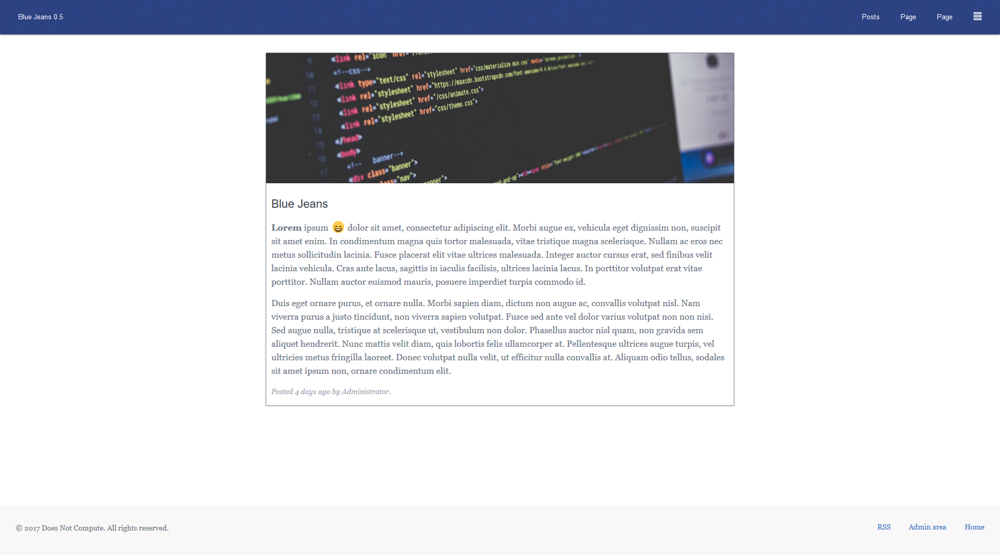
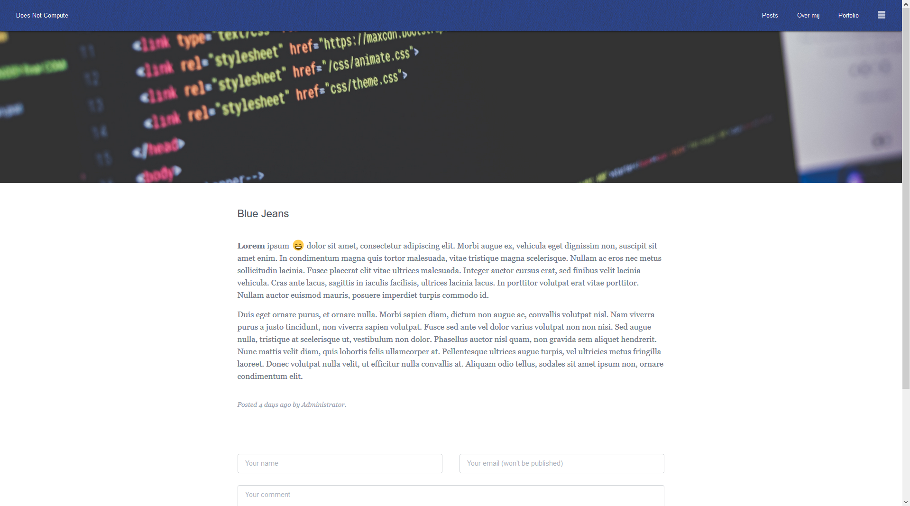
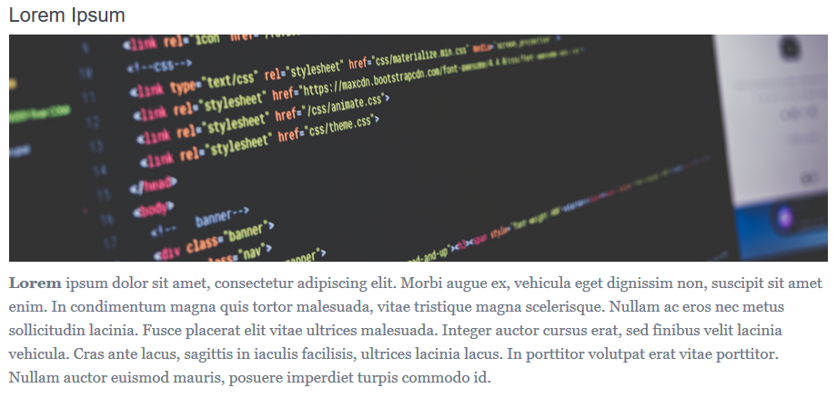
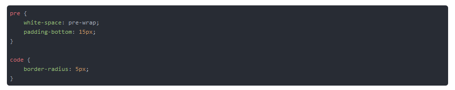

## Blue Jeans




This theme is made to work with Anchor CMS. If you want to try it yourself you can copy the contents to the themes folder in your Anchor setup.

## Article Images



To add a banner image to an article, you have to add a custom field.
To do this log in to the admin panel and go to Extend > Custom Fields > Create a new Field.

The type must be post, field must be image. The Unique key is article_image, but you can change it in posts.php. You can give it any label you like.
When done, you can upload an image when making/editing an article.

## Code Highlighting



To highlight code, the theme makes use of [Highlight.js](https://github.com/isagalaev/highlight.js). To enable it, you have to create a site variable.
To add this, log in to the admin panel and go to Extend > Site Variables > Create a new variable. The name must be code_highlighting, you can set it either true or false.

## Emoji's

The theme supports a variety of emoji's which can be found [here](https://www.webpagefx.com/tools/emoji-cheat-sheet/). You can insert emoji's by using markdown. Just remove the "::" and change underscores to hyphens to use them :smile:

```
[emoji-name](#emoji-name)
```
